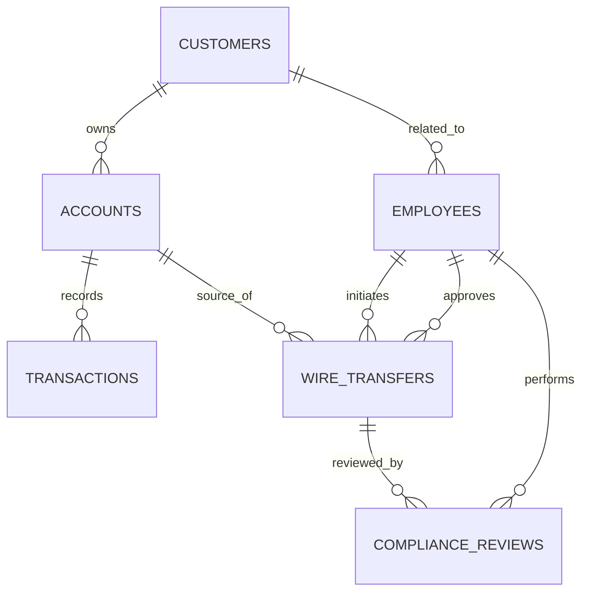

# Sterling & Vance Bank B 

## 1. Company Overview

Sterling & Vance Bank B is a commercial bank that provides customer account management and wire transfer services. The bank is developing an AI assistant to help employees access customer accounts and initiate wire transfers more efficiently while maintaining security and compliance controls.

# 2. Problem Description

At Sterling & Vance Bank, employees handle customer wire transfers every day. To make their work faster, the bank is introducing an AI assistant that can help employees access customer accounts, review transactions, and initiate wire transfers.

However, giving an AI system the ability to perform financial actions introduces a serious risk. A transfer requested by an employee could involve fraud, money laundering, or a sanctions violation, and an AI acting without proper controls could complete a harmful transaction before anyone reviews it.

To prevent this, the system must include checkpoints where the AI stops and requests human intervention in high-risk situations.

The system handles three main risk scenarios:

1. A wire transfer is sent to a country on a sanctions or watch list, requiring approval from a compliance officer before completion.
2. A customer receives multiple incoming transactions from different sources followed by an outgoing wire transfer, which may indicate suspicious activity and requires human review.
3. A bank employee attempts to transfer money to an account connected to themselves or a related party, causing the transfer to be blocked and escalated to a fraud investigator.

The goal is to build an AI assistant that can support employees while ensuring that sensitive financial operations remain secure, controlled, and compliant.

# 3. System Architecture

Before this project, an employee who wanted to check an account or send a
wire used the bank's internal teller application directly, with anything
unusual escalated to a human compliance/fraud reviewer by phone or in
person. The naive version of "connect an LLM to this" — direct SQL access,
or a single `wire_transfer()` tool with no checks — would let an agent move
money to a sanctioned country, launder structured deposits, or self-deal,
and complete it before anyone reviewed it. That's the risk this server is
built around.

**Components:**
- `db/` — SQLite schema + seed data (`bank.db`), built from `schema.sql` + `seed.sql`.
- `mcp/` — the MCP server (`server.py`, `db_access.py`, `schemas.py`, `policy_document.py`).
- `client/` — a LangChain + Groq agent wired to the server as an MCP client (`client.py`).

**Transport:** stdio for local development (`python server.py`), Streamable
HTTP for deployment (`TRANSPORT=http python server.py`). A single-branch
demo runs fine over stdio; a real multi-branch chain needs more than one
employee session hitting the server concurrently, which stdio's
one-process-per-connection model doesn't support — see `run_stdio()` /
`run_http()` in `mcp/server.py`.

# 4. Database & ERD

Engine: **SQLite** (`db/bank.db`), schema in `db/schema.sql`, seed data in
`db/seed.sql`, ERD source in `db/erd_source.dbml` and Mermaid in `db/README.md`.


(full field list in `db/README.md`)

Seed data covers normal cases (a clean $3,000 wire) and every edge case the
tools need: a sanctioned destination country, three near-$5,000 deposits
that read as structuring, and an employee linked to a customer to trigger
self-dealing. `compliance_reviews` — present in the schema from the start
but previously never written to — now gets a row every time a flagged
wire's elicitation is resolved (see `mcp/db_access.py`).

# 5. MCP Implementation

All 8 protocol concerns are implemented in `mcp/server.py` (server side)
and `client/client.py` (client side). Full concern-by-concern pointers with
function names and trigger conditions are in `mcp/README.md`. Summary:

- **Capability negotiation** — server declares tool/resource/prompt support
  in `create_initialization_options()`; server checks the *client's*
  declared elicitation/sampling capability before using either; client
  checks the *server's* declared resources/prompts capability before
  fetching them.
- **Notifications** — `login()` pushes `tools/list_changed` when a
  compliance/fraud employee logs in; the client reacts via a real
  `tool_list_changed_callback`, not polling.
- **Elicitation** — `wire_transfer()` pauses for human approval on any
  sanctions/structuring/self-dealing/AI-high-risk flag.
- **Resources** — the wire-transfer escalation policy, read via
  `resources/read` instead of being wrapped in a tool.
- **Prompts** — `draft_compliance_hold_notice`, a parameterized template for
  explaining a held wire to a customer.
- **Sampling** — flagged wires get a risk read from the *client's* model via
  `create_message`, never the server's own reasoning.
- **Transport** — stdio in dev, Streamable HTTP for deployment.
- **Progress tracking** — `batch_sanctions_scan` reports per-transaction progress.
- **Defensive tool design** — see section 6.

# 6. Tools Comparison

| Tool | Read/Write | Requires elicitation? | If client lacks the capability it depends on |
|---|---|---|---|
| `login` | write (session state only) | no | works with any client |
| `get_account` | read-only | no | works with any client |
| `wire_transfer_initiate` | **write** (moves money) | yes, when flagged | no elicitation support → wire held as `pending_manual_review` instead of silently approved or silently dropped. No sampling support → falls back to a rule-based risk note instead of an AI read. |
| `batch_sanctions_scan` | read-only, but only visible after a compliance/fraud login | no | not shown to a client until the tool-list-changed notification fires |

`wire_transfer_initiate` is the one genuinely risky, state-dependent tool —
it's why elicitation, sampling, and the notification-gated tool set all
exist in this project. Its input schema (`WIRE_TRANSFER_SCHEMA` in
`mcp/schemas.py`) constrains types, required fields,
`additionalProperties: false`, a numeric range on `amount`, and a 2-char
country code — and the handler independently re-checks balance, the
employee's wire-authority limit, and that `employee_id` in the arguments
matches who is actually logged in for that session, because schema
validation alone can't catch any of those.

# 7. Demo

**Recording:** https://drive.google.com/drive/folders/1p1KFCLTxXnEb_RgH6k0S1WrFTzqmVIGu

Full step-by-step walkthrough, the exact 16 test cases used, and expected
output for each is in [`demo/demo.md`](demo/demo.md) — including the ones
that need a standalone script instead of the chat agent (identity mismatch)
and the ones verified separately over HTTP (transport).

Quick setup:
```bash
pip install -r requirements.txt
# set GROQ_API_KEY in .env
python3 db/reset_balances.py   # repeatable starting state before every run
python3 client/client.py
```

# 8. Milestones — bugs we found and fixed while building this

We treated our own demo as a test suite, not just a script to read from.
Testing the real system surfaced 12 real bugs across the server and client,
documented in full with root causes in [`BUGS_FOUND.md`](BUGS_FOUND.md) and
tracked as individual GitHub Issues (#5–#16) closed through their fixing PRs.
Summary:

| # | Bug | Where |
|---|---|---|
| 1 | `elicit_form()` doesn't exist — every flagged wire crashed instead of pausing | `mcp/server.py` |
| 2 | Progress token read from the wrong attribute — batch scan never sent updates | `mcp/server.py` |
| 3 | Client never handled `notifications/progress` at all | `client/client.py` |
| 4 | Policy resource fetched but never given to the model's context | `client/client.py` |
| 5 | Tool errors silently repackaged as normal chat text (`isError` ignored) | `client/client.py` |
| 6 | Ambiguous system prompt let the LLM fake elicitation itself in chat | `client/client.py` |
| 7 | Progress updates never requested — missing `progress_callback` on `call_tool()` | `client/client.py` |
| 8 | Transport run command pointed at a path that doesn't exist | `mcp/server.py` (docstring) |
| 9 | Identity-mismatch check untestable through the chat agent | `demo/test_identity_mismatch.py` (added) |
| 10 | HTTP transport declared `tools.listChanged: false` — stdio and HTTP disagreed | `mcp/server.py` |
| 11 | Sampling call crashed on `maxTokens` vs `max_tokens` (wire format vs Python SDK) | `mcp/server.py` |
| 12 | Sampling ran completely silently — no visible evidence it fired | `mcp/server.py` |

**Why this matters for grading:** several of these (1, 6, 7, 11, 12) would
have made elicitation, progress tracking, or sampling look present in code
but non-functional in an actual run — exactly the gap the assignment warns
against ("a concern bolted on with no genuine trigger will be obvious in
the demo"). Fixing all 12 is what makes the video in Section 7 an honest
demonstration rather than a rehearsed one.

# 9. Where it stands now

What we'd still worry about running this in production:
- Wire authority limits and roles are hardcoded per-role, not configurable
  per-employee — a real bank would need per-employee overrides.
- HTTP transport is verified via `curl`, not yet through the LangChain
  client itself — pointing the agent at HTTP instead of stdio is the
  natural next step.
- `batch_sanctions_scan` scans a fixed, small seed dataset; a real nightly
  job would need pagination/chunking for a production-sized transaction
  volume.
- Sampling's risk analysis is a single model call with no retry or
  fallback if the client's model is unavailable mid-transaction.
