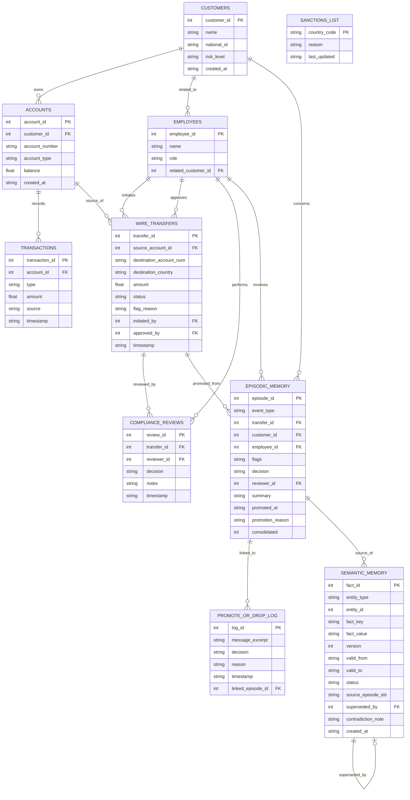

```mermaid
erDiagram
  CUSTOMERS ||--o{ ACCOUNTS : owns
  ACCOUNTS ||--o{ TRANSACTIONS : records
  CUSTOMERS ||--o{ EMPLOYEES : related_to
  ACCOUNTS ||--o{ WIRE_TRANSFERS : source_of
  EMPLOYEES ||--o{ WIRE_TRANSFERS : initiates
  EMPLOYEES ||--o{ WIRE_TRANSFERS : approves
  WIRE_TRANSFERS ||--o{ COMPLIANCE_REVIEWS : reviewed_by
  EMPLOYEES ||--o{ COMPLIANCE_REVIEWS : performs

  CUSTOMERS {
    int customer_id PK
    string name
    string national_id
    string risk_level
    string created_at
  }
  ACCOUNTS {
    int account_id PK
    int customer_id FK
    string account_number
    string account_type
    float balance
    string created_at
  }
  TRANSACTIONS {
    int transaction_id PK
    int account_id FK
    string type
    float amount
    string source
    string timestamp
  }
  EMPLOYEES {
    int employee_id PK
    string name
    string role
    int related_customer_id FK
  }
  WIRE_TRANSFERS {
    int transfer_id PK
    int source_account_id FK
    string destination_account_num
    string destination_country
    float amount
    string status
    string flag_reason
    int initiated_by FK
    int approved_by FK
    string timestamp
  }
  SANCTIONS_LIST {
    string country_code PK
    string reason
    string last_updated
  }
  COMPLIANCE_REVIEWS {
    int review_id PK
    int transfer_id FK
    int reviewer_id FK
    string decision
    string notes
    string timestamp
  }

  WIRE_TRANSFERS ||--o{ EPISODIC_MEMORY : promoted_from
  CUSTOMERS ||--o{ EPISODIC_MEMORY : concerns
  EMPLOYEES ||--o{ EPISODIC_MEMORY : involves
  EPISODIC_MEMORY ||--o{ PROMOTE_OR_DROP_LOG : linked_to
  EPISODIC_MEMORY ||--o{ SEMANTIC_MEMORY : source_of
  SEMANTIC_MEMORY ||--o| SEMANTIC_MEMORY : superseded_by

  EPISODIC_MEMORY {
    int episode_id PK
    string event_type
    int transfer_id FK
    int customer_id FK
    int employee_id FK
    string flags
    string decision
    int reviewer_id FK
    string summary
    string promoted_at
    string promotion_reason
    int consolidated
  }
  PROMOTE_OR_DROP_LOG {
    int log_id PK
    string message_excerpt
    string decision
    string reason
    string timestamp
    int linked_episode_id FK
  }
  SEMANTIC_MEMORY {
    int fact_id PK
    string entity_type
    int entity_id
    string fact_key
    string fact_value
    int version
    string valid_from
    string valid_to
    string status
    string source_episode_ids
    int superseded_by FK
    string contradiction_note
    string created_at
  }
```
